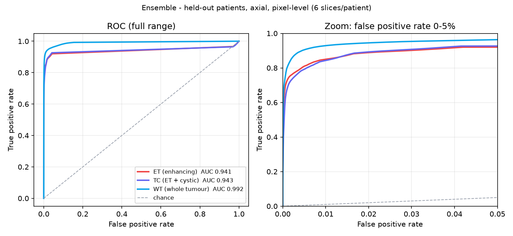

# NeuroPeds AI — Pediatric Brain Tumor Segmentation

A 2D U-Net segmentation system for pediatric brain tumors, trained on the BraTS-PEDs 2024 dataset. Built as part of a medical AI workshop.

**Live demo:** https://neuropeds-ai.streamlit.app

## What it does

- Segments pediatric brain MRI scans across 4 tumor sub-regions: Enhancing Tumor (ET), Non-Enhancing Tumor Core (NETC), Cystic Component (CC), and Peritumoral Edema (ED)
- Runs inference on real held-out patients using the shipped **ensemble** checkpoint (held-out mean Dice 0.754)
- Displays per-region Dice scores, ROC curves, and training history
- Generates clinical PDF reports

## Model

The shipped `best.pt` is an **ensemble of two 2D U-Nets** — the original model (width 16, depth 3) and a wider continued-training model (width 64, depth 3) — whose softmax probabilities are averaged. It beats both members on every region.

Held-out evaluation: 82 patients never used for training, per-patient Dice, axial + coronal predictions averaged (`--eval-plane both`).

| Region | Dice |
|--------|------|
| ET (enhancing tumor) | 0.581 |
| NC (labels ET+NETC+CC) | 0.828 |
| WT (whole tumor) | 0.854 |
| **Mean** | **0.754** |

For reference: original model alone 0.710, wide model alone 0.727. The ensemble was chosen by looking at this same held-out set, so treat 0.754 as slightly optimistic; there is no separate untouched test set.

The live demo predicts **axial slices only**, and the Dashboard's ROC/metrics table (`roc_cache.json`) is a different, cheaper measure — axial only, 6 sampled slices per patient, pixels pooled — so its numbers will not match the table above. ET is the weakest region; the model tends to under-segment (precision exceeds sensitivity).

### Pixel-level metrics (Dashboard measure)

Same ensemble, same 82 held-out patients, axial only, 492 sampled slices, pixels pooled (TC = ET + cystic component, labels 1+3):

| Region | Dice / F1 | Precision | Recall (sensitivity) | Specificity | ROC AUC | Median HD95 |
|--------|-----------|-----------|----------------------|-------------|---------|-------------|
| ET | 0.629 | 0.776 | 0.529 | 0.9998 | 0.941 | 4.2 mm |
| TC | 0.552 | 0.728 | 0.445 | 0.9997 | 0.943 | 4.5 mm |
| WT | 0.842 | 0.924 | 0.773 | 0.9992 | 0.992 | 2.0 mm |

- **F1 is the same number as Dice** for pixel-level segmentation (both are 2·TP / (2·TP + FP + FN)), so they are shown together rather than as two separate metrics. Precision is well above recall in every region, which is the under-segmentation noted above.
- **ROC AUC and specificity flatter this model.** Only 2–18 % of pixels are tumor, so an all-background prediction already scores ~0.98 specificity. Use Dice/F1 and recall as the headline numbers; the ROC curves are most informative in the low false-positive zoom on the right.



Architecture: 2D U-Net with optional MixUp augmentation and tumor-type classification head. Trained on axial slices from 4 MRI modalities (T1c, T1n, T2f, T2w). See `HANDOFF.md` for training history, lessons learned and what to do next.

## Repo structure

| Folder | Contents |
|--------|----------|
| `03_augmentation_eval/` | Training pipeline, evaluation scripts, ablation framework |
| `05_frontend_demo/` | Streamlit app + demo cache (7 representative patients) |
| `00_shared/` | Shared contracts and data specifications |

## Running locally

```bash
cd 05_frontend_demo
pip install -r requirements.txt
streamlit run Home.py
```

The app ships with a demo cache of 7 held-out patients covering all 4 tumor label types. Set `NEUROFED_CACHE_2D` to point at a full 2D slice cache for the complete dataset.
